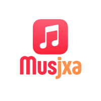

<p align="center">
  
</p>

<h1 align="center">Musjxa</h1>

<p align="center">
  Broadcast your Apple Music "now playing" to any channel — Twitter/X, Telegram, Pumble, or your own custom plugin.<br>
  Built entirely with JXA (JavaScript for Automation), zero dependencies, native macOS.
</p>

## How it works

Musjxa polls Apple Music every few seconds. When the track changes, it sends the song info to every enabled channel in your config. Channels are pluggable `.js` files — add your own without touching the core script.

```
musjxa.js          <- core script
config.json        <- your channels + credentials
channels/
  logger.js        <- macOS system log
  twitter.js       <- Twitter/X API
  telegram.js      <- Telegram Bot API
  pumble.js        <- Pumble webhook
  your-channel.js  <- drop your own here
```

## Quick start

```bash
git clone https://github.com/asdrubalchirinos/musjxa.git
cd musjxa
cp config.example.json config.json   # edit with your credentials
osascript -l JavaScript musjxa.js
```

The script starts polling and shows a macOS notification when it launches.

## Configuration

Edit `config.json` to enable channels and set credentials:

```json
{
  "pollInterval": 5,
  "channels": [
    {
      "type": "logger",
      "enabled": true,
      "template": "🎧 Now playing\n\n{{track}} — {{artist}}"
    },
    {
      "type": "telegram",
      "enabled": true,
      "template": "🎵 {{track}} by {{artist}}",
      "botToken": "123456:ABC-DEF...",
      "chatId": "-1001234567890"
    }
  ]
}
```

- **type** — must match a filename in `channels/` (e.g. `"telegram"` loads `channels/telegram.js`)
- **enabled** — `true`/`false` to toggle without removing the config
- **template** — message format; `{{track}}` and `{{artist}}` are replaced at runtime
- Any extra fields (tokens, URLs, etc.) are passed to the plugin

## Built-in channels

| Channel | Type | Required fields |
|---------|------|-----------------|
| macOS system log | `logger` | — |
| Twitter/X | `twitter` | `bearerToken` |
| Telegram | `telegram` | `botToken`, `chatId` |
| Pumble | `pumble` | `webhookUrl` |

## Writing a plugin

Create a file in `channels/` with a `post(message, channel)` function. That's it.

```javascript
// channels/discord.js
function post(message, channel) {
    const body = JSON.stringify({ content: message })
    curlPost(channel.webhookUrl, ["Content-Type: application/json"], body)
}
```

Available globals your plugin can use:
- `curlPost(url, headers, jsonBody)` — HTTP POST via curl
- `shellEscape(str)` — escape strings for shell commands
- `app` — JXA Standard Additions (for `doShellScript`, etc.)
- `$` — ObjC bridge (Foundation framework)

The `channel` parameter contains everything from the config entry, so you can define whatever custom fields you need.

## Status & process management

Musjxa writes a PID file (`musjxa.pid`) at startup.

```bash
# Check if running
cat musjxa.pid | xargs ps -p

# Stop
kill $(cat musjxa.pid)
```

## Custom notification icon

By default, startup notifications use the Script Editor icon. Install [terminal-notifier](https://github.com/julienXX/terminal-notifier) for custom icons:

```bash
brew install terminal-notifier
```

Then place an `icon.png` in the project directory — Musjxa will use it automatically.

## Viewing logs

The logger channel writes to the macOS unified log:

```bash
/usr/bin/log stream --predicate 'senderImagePath contains "logger"' --style compact
```

## Requirements

- macOS
- Apple Music
- No other dependencies

## License

[MIT](LICENSE)
